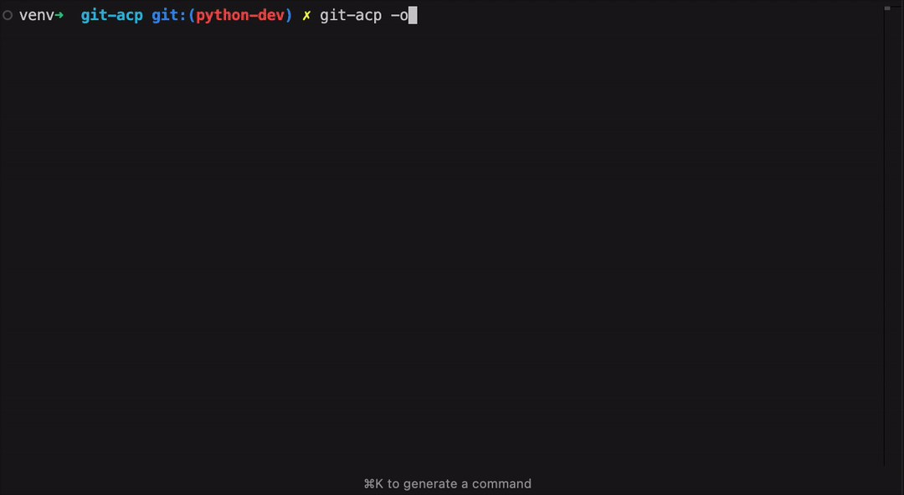

# git-acp

A Python tool to automate Git add, commit, and push actions with optional AI-generated commit messages using Ollama. Features a beautiful CLI interface with color-coded output and progress indicators.


## Table of Contents

- [Features](#features)
- [Prerequisites](#prerequisites)
- [Installation](#installation)
- [Usage](#usage)
- [Environment Configuration](#environment-configuration)
- [License](#license)
- [Contributing](#contributing)

## Features

- Automates git add, commit, and push operations in a single command
- Smart interactive file selection with status indicators
- AI-powered commit message generation using Ollama
- Intelligent commit type suggestions based on file changes and commit history
- Conventional commits format with emoji support
- Beautiful CLI interface with:
  - Color-coded output for different message types
  - Progress indicators for long-running operations
  - Debug information in verbose mode
- Highly configurable through:
  - Command-line arguments
  - Environment variables
  - Interactive prompts
- Safety features:
  - Confirmation prompts (optional)
  - Automatic branch detection
  - Error handling with descriptive messages
  - File exclusion patterns for common build artifacts

## Prerequisites

- Python 3.6 or higher
- Git installed and configured
- Ollama installed (optional, for AI-generated commit messages)
- pipx (optional, for global installation)

## Installation

For detailed installation instructions, please refer to the [Installation Guide](./docs/getting_started/installation.md).

### Option 1: Global Installation with pipx (Recommended)

[pipx](https://pypa.github.io/pipx/) is the recommended way to install Python CLI applications globally. It creates isolated environments for each application, ensuring dependency conflicts are avoided.

1. Install pipx if you haven't already:

    ```bash
    # On macOS
    brew install pipx
    pipx ensurepath

    # On Linux
    python3 -m pip install --user pipx
    python3 -m pipx ensurepath
    ```

2. Install git-acp:

    ```bash
    # Install from GitHub
    pipx install "git+https://github.com/beecave-homelab/git-acp.git"

    # Or install from local directory (if you've cloned the repo)
    pipx install .
    ```

The command `git-acp` will now be available globally in your system.

To upgrade to the latest version:

```bash
pipx upgrade git-acp
```

To uninstall:

```bash
pipx uninstall git-acp
```

### Option 2: Install in a Virtual Environment

1. Clone the repository:

    ```bash
    git clone https://github.com/beecave-homelab/git-acp.git
    cd git-acp
    ```

2. Create and activate a virtual environment:

    ```bash
    # Create virtual environment
    python -m venv venv

    # Activate on macOS/Linux
    source venv/bin/activate
    ```

3. Install the package:

    ```bash
    pip install .
    ```

## Usage

For more detailed usage examples, please refer to the [Basic Usage](./docs/usage/basic_usage.md) and [Advanced Usage](./docs/usage/advanced_usage.md) guides.

After installation, you can use the `git-acp` command from anywhere in your terminal. The tool provides both interactive and command-line interfaces:

```bash
git-acp [OPTIONS]
```

### Interactive Mode (Default)

Without any options, the tool runs in interactive mode:

1. Shows status of changed files
2. Presents a multi-select menu for choosing files to stage
3. Suggests a commit type based on the changes
4. Generates or prompts for a commit message
5. Shows a preview and confirmation before pushing



### Options

- `-a, --add <file>`: Add specified file(s) to staging. If not specified, shows interactive file selection.
- `-m, --message <msg>`: Commit message. Defaults to 'Automated commit'.
- `-b, --branch <branch>`: Specify the branch to push to. Defaults to current active branch.
- `-o, --ollama`: Use Ollama AI to generate commit message based on your changes.
- `-i, --interactive`: Allow editing of AI-generated commit message (requires --ollama).
- `-nc, --no-confirm`: Skip confirmation prompts.
- `-t, --type <type>`: Override automatic commit type suggestion. Available types: feat, fix, docs, style, refactor, test, chore, revert.
- `-v, --verbose`: Show detailed debug information.
- `-p, --prompt-type <type>`: Type of prompt to use for AI commit message generation (simple or advanced).
- `--help`: Show help message and exit.

### Examples

1. Fully interactive mode (recommended for most cases):

    ```bash
    git-acp
    ```

2. Add specific files with a message:

    ```bash
    git-acp -a "README.md docs/*" -m "Update documentation"
    ```

3. Use AI to generate commit message:

    ```bash
    git-acp -o
    ```

4. Quick commit all changes without confirmations:

    ```bash
    git-acp -nc -m "Quick fix" -a .
    ```

5. Push to specific branch with verbose output:

    ```bash
    git-acp -b feature/new-branch -v
    ```

6. Specify commit type and message:

    ```bash
    git-acp -t feat -m "Add new login feature"
    ```

7. AI message for specific files and type:

    ```bash
    git-acp -a "src/auth/*" -t feat -o
    ```

## Environment Configuration

For setting up the environment, please refer to the [Introduction to Environment Configuration](./docs/getting_started/introduction.md).

The tool can be customized using environment variables. Configuration is done through:

1. Create a `.env` file in `~/.config/git-acp/.env`
2. Copy the contents from the `.env.example` file and modify as needed

Available configurations are organized into categories:

### AI Configuration

- `GIT_ACP_AI_MODEL`: Model name for Ollama (default: mevatron/diffsense:1.5b)
- `GIT_ACP_TEMPERATURE`: Temperature for AI generation (0.0 to 1.0, higher = more creative, default: 0.7)
- `GIT_ACP_BASE_URL`: Ollama API endpoint (default: <http://localhost:11434/v1>)
- `GIT_ACP_API_KEY`: API key for Ollama (default: "ollama")
- `GIT_ACP_PROMPT_TYPE`: Type of prompt for commit message generation ("simple" or "advanced", default: advanced)
- `GIT_ACP_AI_TIMEOUT`: Timeout for AI requests in seconds (default: 120.0)

### Git Configuration

- `GIT_ACP_DEFAULT_BRANCH`: Default branch name for push operations (default: main)
- `GIT_ACP_DEFAULT_REMOTE`: Default remote name (default: origin)
- `GIT_ACP_NUM_RECENT_COMMITS`: Number of recent commits to analyze for context (default: 3)
- `GIT_ACP_NUM_RELATED_COMMITS`: Number of related commits to analyze (default: 3)
- `GIT_ACP_MAX_DIFF_PREVIEW_LINES`: Maximum number of diff lines to preview (default: 10)

### Terminal Configuration

- `GIT_ACP_TERMINAL_WIDTH`: Maximum width for formatted output (default: 100)
- Color configurations for different output types:
  - `GIT_ACP_DEBUG_HEADER_COLOR`: Color for debug headers (default: blue)
  - `GIT_ACP_DEBUG_VALUE_COLOR`: Color for debug values (default: cyan)
  - `GIT_ACP_SUCCESS_COLOR`: Color for success messages (default: green)
  - `GIT_ACP_WARNING_COLOR`: Color for warnings (default: yellow)
  - `GIT_ACP_STATUS_COLOR`: Color for status messages (default: bold green)
  - `GIT_ACP_ERROR_COLOR`: Color for error messages (default: bold red)
  - `GIT_ACP_AI_MESSAGE_HEADER_COLOR`: Color for AI message headers (default: bold yellow)
  - `GIT_ACP_AI_MESSAGE_BORDER_COLOR`: Color for AI message borders (default: yellow)
  - `GIT_ACP_KEY_COMBINATION_COLOR`: Color for key combinations (default: cyan)
  - `GIT_ACP_INSTRUCTION_TEXT_COLOR`: Color for instruction text (default: dim)
  - `GIT_ACP_BOLD_COLOR`: Color for bold text (default: dim)

### Commit Types Configuration

Customize commit types and their emojis:

- `GIT_ACP_COMMIT_TYPE_FEAT`: Feature commits (default: "feat ✨")
- `GIT_ACP_COMMIT_TYPE_FIX`: Bug fix commits (default: "fix 🐛")
- `GIT_ACP_COMMIT_TYPE_DOCS`: Documentation commits (default: "docs 📝")
- `GIT_ACP_COMMIT_TYPE_STYLE`: Style/formatting commits (default: "style 💎")
- `GIT_ACP_COMMIT_TYPE_REFACTOR`: Refactoring commits (default: "refactor ♻️")
- `GIT_ACP_COMMIT_TYPE_TEST`: Test commits (default: "test 🧪")
- `GIT_ACP_COMMIT_TYPE_CHORE`: Chore/maintenance commits (default: "chore 📦")
- `GIT_ACP_COMMIT_TYPE_REVERT`: Revert commits (default: "revert ⏪")

## Commit Types

The tool intelligently suggests commit types based on your changes and commit history. Available types:

- `feat ✨`: New features or significant enhancements
- `fix 🐛`: Bug fixes and error corrections
- `docs 📝`: Documentation changes only
- `style 💎`: Code style/formatting changes (no functional changes)
- `refactor ♻️`: Code refactoring without functional changes
- `test 🧪`: Adding or modifying tests
- `chore 📦`: Maintenance tasks, dependencies, build changes
- `revert ⏪`: Reverting previous changes

The tool analyzes your changes and suggests the most appropriate type, but you can choose any type using the interactive selector or override it with the `-t` option.

## License

This project is licensed under the MIT license. See [LICENSE](LICENSE) for more information.

## Contributing

Pull requests are welcome. For major changes, please open an issue first to discuss what you would like to change.
