<!-- markdownlint-disable-file MD033 -->
<!-- SECTIONS:API,CLI,WEBUI,CI,DOCKER,TESTS -->

# Project Overview | git-acp

`git-acp` is a command-line tool that automates the `git add`, `commit`, and `push` workflow. It offers interactive file selection, AI-powered commit message generation via Ollama, and enforces Conventional Commits standards.


[](#version-summary)
[](#cli)
[](#tests)

## Table of Contents

- [Quickstart for Developers](#quickstart-for-developers)
- [Version Summary](#version-summary)
- [Project Features](#project-features)
- [Project Structure](#project-structure)
- [Architecture Highlights](#architecture-highlights)
- [Design Patterns](#design-patterns)
- [Coding Standards](#coding-standards)
- [CLI](#cli)
- [API](#api)
- [Tests](#tests)

## Quickstart for Developers

::: details

```bash
# Recommended installation with pipx
pipx install "git+https://github.com/beecave-homelab/git-acp.git"

# Local development setup
git clone https://github.com/beecave-homelab/git-acp.git
cd git-acp
pip install pdm # if not already installed
pdm install -G dev && pdm run git-acp --help
```

### Exporting Requirements Files

Always regenerate the lock-style requirement files from [`pyproject.toml`](pyproject.toml) using `pdm`:

```bash
# Production requirements
pdm export --pyproject --no-hashes --prod -o requirements.txt

# Dev / lint / test requirements
pdm export --pyproject --no-hashes -G lint,test -o requirements.dev.txt
```

:::

## Version Summary

| Version | Date       | Type | Key Changes                |
|---------|------------|------|----------------------------|
| 0.20.0  | 20-12-2025 | ✨   | Add --dry-run flag for testing workflow without committing |
| 0.19.0  | 19-12-2025 | ✨   | Improve commit type recommendation (file paths + emoji prefix) |
| 0.18.0  | 02-12-2025 | ✨   | Fix -a flag logic, update eza, enhance tests & UX |
| 0.17.0  | 10-08-2025 | ✨   | Add fallback Ollama server; git ops flattening |
| 0.16.0  | 2025-08-08 | ✨   | Refactors and enhancements; feature work |
| 0.15.1  | 2024-07-08 | 🐛   | Fixed -a flag logic, minor enhancements |
| 0.15.0  | 2025-06-20 | ✨   | Enhanced CLI & version bump |
| 0.14.1  | YYYY-MM-DD | ✨   | Initial project setup      |

## Project Features

- Interactive staging of changed files.
- AI-generated commit messages using Ollama.
- **Smart commit type classification** using file-path-first heuristics with keyword fallback.
- Support for Conventional Commits specification.
- Consistent "all files" selection: choose **All files** in the prompt or use `-a .` to stage everything while still listing each file before commit.
- Rich terminal output for better user experience.
- Skipping confirmation prompts for faster workflow.
- Verbose mode for debugging.

## Project Structure

::: details

```text
git_acp/
├── __init__.py             # Exposes the package version.
├── __main__.py             # Main entry point, calls the CLI.
├── ai/
│   ├── __init__.py         # Exposes the commit message generation function.
│   ├── ai_utils.py         # Builds commit message prompts and editing helpers.
│   └── client.py           # AIClient with dependency injection for testability.
├── cli/
│   ├── __init__.py         # Exposes CLI, workflow, and interaction classes.
│   ├── cli.py              # Slim CLI entry point using Click (delegates to workflow).
│   ├── interaction.py      # UserInteraction protocol and implementations.
│   └── workflow.py         # GitWorkflow orchestrator for add-commit-push flow.
├── commit/                 # (empty) Intended for future commit-related logic.
├── pr/                     # (empty) Intended for future pull request helpers.
├── config/
│   ├── __init__.py         # Exposes all configuration constants and functions.
│   ├── constants.py        # Defines static configuration values and defaults.
│   └── env_config.py       # Manages loading of environment variables.
├── git/
│   ├── __init__.py         # Exposes all public Git operation functions (facade).
│   ├── classification.py   # File-path-first commit type classification.
│   ├── core.py             # Core git utilities and error handling.
│   ├── diff.py             # Diff generation and formatting.
│   ├── git_operations.py   # Compatibility layer for testable git helpers.
│   ├── history.py          # Commit history and analysis utilities.
│   ├── management.py       # Branch and repository management.
│   ├── operations.py       # Re-exports public functions (facade pattern).
│   └── staging.py          # File staging and change detection.
└── utils/
    ├── __init__.py         # Exposes utility functions and types.
    ├── formatting.py       # Provides styled terminal output functions.
    └── types.py            # Defines custom data types and type aliases.

tests/
├── __init__.py
├── ai/                     # AIClient and AI utilities tests.
├── cli/                    # CLI entry point and GitWorkflow tests.
├── config/                 # Configuration tests.
├── git/                    # Git operations tests.
└── utils/                  # Utility function tests.
```

## Architecture Highlights

- **CLI Layer**: Built with `click`, delegates to `GitWorkflow` orchestrator.
- **Workflow Orchestration**: `GitWorkflow` coordinates add-commit-push operations with injected dependencies.
- **User Interaction Protocol**: `UserInteraction` protocol abstracts `questionary`/`rich` for testability.
- **Dependency Injection**: `AIClient` and `GitWorkflow` accept injected dependencies for testing.
- **Modular Design**: Separate packages for AI, CLI, git operations, and configuration.
- **SOLID Principles**: Single Responsibility (workflow vs CLI), Dependency Inversion (protocols).

### Component Interaction Diagram


### Data Flow Overview

High-level flow when running `git-acp --ollama`:


### Deep Dive: GitWorkflow

The orchestrator that coordinates the entire add-commit-push workflow.


### Deep Dive: GitOps (Facade)

The [`operations.py`](git_acp/git/operations.py) facade re-exports functions from internal modules.


### Deep Dive: AI Prompt Types

The AI layer supports two prompt generation modes with different complexity levels and context window management:

```mermaid
flowchart TD
    A[generate_commit_message] --> B[get_commit_context]
    B --> C[calculate_context_budget]
    C --> D[truncate_context_for_window]
    D --> E[prompt_type?]
    
    E -->|simple| F[create_structured_simple_commit_message_prompt]
    E -->|advanced| G[create_structured_advanced_commit_message_prompt]
    
    F --> H["Structured XML prompt:<br/>• Context-aware truncation<br/>• 65% context window usage<br/>• Local-first optimization<br/>• 4 structured sections"]
    G --> I["Structured XML prompt:<br/>• Full context utilization<br/>• 80% context window usage<br/>• Repository pattern matching<br/>• 5 structured sections"]
    
    H --> J[ai_client.chat_completion]
    I --> J
    
    J --> K[edit_commit_message<br/>if interactive]
    K --> L[Return formatted message]
    
    style F fill:#e1f5fe
    style G fill:#f3e5f5
    style H fill:#e8f5e9
    style I fill:#fff3e0
```



**Simple Mode (`simple`) - Local-First Design**

- **Context Window Strategy**: Uses 65% of available context window (leaving 35% for response)
- **Smart Truncation**: Priority-based context reduction (related commits → recent commits → patterns)
- **XML-Structured Prompts**: Clear sections with `<task>`, `<changes>`, `<requirements>`, `<output_format>`
- **Local Optimization**: Designed for smaller local models (4K-8K context windows)
- **Minimum Context Guarantee**: Ensures at least 2000 tokens of staged changes are preserved

**Advanced Mode (`advanced`) - Context-Optimized**

- **Context Window Strategy**: Uses 80% of available context window (leaving 20% for response)
- **Rich Repository Context**:
  - Recent commit history and patterns
  - Most used commit types and scopes
  - Related commits for similar files
  - Repository style guidance
- **XML-Structured Prompts**: Enhanced with `<repository_context>` and `<style_guide>` sections
- **Cloud & Local Support**: Optimized for both large cloud models and capable local models
- **Pattern Matching**: Generates messages that match repository conventions

**Context Window Management:**

- **Token Estimation**: Simple 4-characters-per-token approximation
- **Priority-Based Truncation**: Preserves most important context first
- **Dynamic Adjustment**: Adapts to different context window sizes
- **Configuration**: Environment variables for fine-tuning (`GIT_ACP_SIMPLE_CONTEXT_RATIO`, `GIT_ACP_ADVANCED_CONTEXT_RATIO`)

### Deep Dive: AI Layer

AI-powered commit message generation with fallback support.


### Deep Dive: UserInteraction

Protocol-based abstraction for testable user I/O.


## Design Patterns

- Protocol-based user I/O for testability.
- Dependency injection for AI client/workflow.

### Protocol Pattern (Structural Typing)

The `UserInteraction` protocol in [`interaction.py`](git_acp/cli/interaction.py) defines an interface for user I/O:

```python
class UserInteraction(Protocol):
    def select_files(self, changed_files: set[str]) -> str: ...
    def select_commit_type(self, suggested_type: CommitType, config: GitConfig, commit_message: str) -> CommitType: ...
    def confirm(self, message: str) -> bool: ...
    def print_message(self, message: str) -> None: ...
    def print_error(self, error_msg: str, suggestion: str, title: str) -> None: ...
    def print_panel(self, content: str, title: str, style: str) -> None: ...
```

**Implementations:**

- `RichQuestionaryInteraction` — Production implementation using Rich + Questionary.
- `TestInteraction` — Test double with canned responses for unit testing.

### Dependency Injection

`GitWorkflow` and `AIClient` accept injected dependencies:

```python
# GitWorkflow accepts UserInteraction
class GitWorkflow:
    def __init__(self, config: GitConfig, interaction: UserInteraction, ...) -> None:

# AIClient accepts OpenAI client and progress factory
class AIClient:
    def __init__(self, config: OptionalConfig = None, *,
                 _openai_client: OpenAI | None = None,
                 _progress_factory: ProgressFactory | None = None) -> None:
```

### Facade Pattern

The [`git/__init__.py`](git_acp/git/__init__.py) and [`git/operations.py`](git_acp/git/operations.py) modules expose a unified API:

```python
# git/__init__.py re-exports all public functions
from git_acp.git.operations import (
    GitError, get_changed_files, get_current_branch, get_diff,
    git_add, git_commit, git_push, run_git_command, ...
)
```

Internal modules ([`core.py`](git_acp/git/core.py), [`staging.py`](git_acp/git/staging.py), [`diff.py`](git_acp/git/diff.py), etc.) remain implementation details.

### Dataclass Configuration

`GitConfig` in [`utils/types.py`](git_acp/utils/types.py) uses `@dataclass` for immutable configuration:

```python
@dataclass
class GitConfig:
    files: str = "."
    message: str = "Automated commit"
    branch: str | None = None
    use_ollama: bool = False
    interactive: bool = False
    skip_confirmation: bool = False
    verbose: bool = False
    prompt_type: str = "advanced"
```

### Enum for Commit Types

`CommitType` in [`classification.py`](git_acp/git/classification.py) uses `Enum` with a factory method:

```python
class CommitType(Enum):
    FEAT = "feat"
    FIX = "fix"
    # ...

    @classmethod
    def from_str(cls, value: str) -> "CommitType":
        # Converts string to enum, raises GitError on invalid input
```

### Commit Type Classification

The `classify_commit_type()` function uses a priority-based approach:

| Priority | Source | Description |
|----------|--------|-------------|
| 1 | Message prefix | Explicit `feat:`, `feat ✨:`, `fix:`, `fix 🐛:`, etc. in commit message |
| 2 | File paths | `tests/` → test, `docs/` → docs, `.github/` → chore |
| 3 | Message keywords | Semantic hints like "implement", "fix", "refactor" |
| 4 | Diff keywords | Fallback pattern matching in git diff |
| 5 | Default | Returns `CHORE` when no patterns match |

The implementation lives in [`git_acp/git/classification.py`](git_acp/git/classification.py).
File path patterns are defined in [`git_acp/config/constants.py`](git_acp/config/constants.py) (`FILE_PATH_PATTERNS`).

```mermaid
flowchart TD
    A[Start: classify_commit_type] --> B{Commit message has a title line?}
    B -->|yes| C[Parse prefix<br/>feat:, fix:, feat(scope) ✨: ...]
    C -->|parsed| R1[Return parsed type]
    C -->|not parsed| D[Get changed files<br/>(staged then unstaged)]
    B -->|no| D
    D --> E{File path patterns match?}
    E -->|yes (majority)| R2[Return file-based type]
    E -->|no| F{Commit message provided?}
    F -->|yes| G[Keyword match in commit message]
    G -->|matched| R3[Return matched type]
    G -->|no match| H[Get diff<br/>(staged then unstaged)]
    F -->|no| H
    H --> I[Keyword match in diff]
    I -->|matched| R4[Return matched type]
    I -->|no match| R5[Return CHORE]
```

## Coding Standards

### Linting & Formatting (Ruff)

Configured in [`pyproject.toml`](pyproject.toml):

```toml
[tool.ruff]
line-length = 88
target-version = "py310"

[tool.ruff.lint]
select = ["F", "E", "W", "N", "I", "D", "DOC", "TID", "UP", "FA"]

[tool.ruff.lint.pydocstyle]
convention = "google"
```

**Key rules enforced:**

- **F** (Pyflakes): No undefined names, unused imports.
- **E/W** (pycodestyle): PEP 8 spacing, indentation.
- **N** (pep8-naming): `snake_case` functions, `PascalCase` classes.
- **I** (isort): Sorted, grouped imports.
- **D/DOC** (pydocstyle): Google-style docstrings.
- **UP** (pyupgrade): Modern Python syntax (f-strings, PEP 585 generics).
- **FA** (future-annotations): `from __future__ import annotations`.

### SOLID Principles Applied

| Principle | Application |
|-----------|-------------|
| **SRP** | [`cli.py`](git_acp/cli/cli.py) handles CLI parsing only; [`workflow.py`](git_acp/cli/workflow.py) handles orchestration. |
| **OCP** | `UserInteraction` protocol allows new implementations without modifying `GitWorkflow`. |
| **LSP** | `TestInteraction` is substitutable for `RichQuestionaryInteraction`. |
| **ISP** | Protocol methods are minimal and focused. |
| **DIP** | `GitWorkflow` depends on `UserInteraction` abstraction, not concrete classes. |

### Testing Conventions

- **Naming**: `test_<unit>__<expected_behavior>()`
- **Fixtures**: Use `pytest` fixtures for reusable setup.
- **Mocking**: Patch at the module boundary (e.g., `git_acp.git.git_operations.run_git_command`).
- **Coverage**: Target ≥85% line coverage with branch coverage enabled.

### Type Hints

All public functions and methods use type hints:

```python
def get_changed_files(
    config: OptionalConfig = None, staged_only: bool = False
) -> set[str]: ...
```

Type aliases in [`utils/types.py`](git_acp/utils/types.py):

```python
OptionalConfig = GitConfig | None
PromptType = Literal["simple", "advanced"]
DiffType = Literal["staged", "unstaged"]
```

:::

## CLI

The main entry point is `git_acp.cli.cli.main`. It provides a set of options to control the git workflow.

**Options:**

- `-a, --add`: Specify files to stage.
- `-mb, --message-body`: Provide a custom commit message body.
- `-b, --branch`: Target branch for push.
- `-t, --type`: Manually specify commit type.
- `-o, --ollama`: Use AI to generate commit message.
- `-i, --interactive`: Interactively edit AI-generated message.
- `-nc, --no-confirm`: Skip confirmation prompts.
- `-v, --verbose`: Enable verbose output.
- `-dr, --dry-run`: Show what would be committed without actually committing or pushing.
- `-p, --prompt`: Override the prompt sent to the AI model.
- `-pt, --prompt-type`: Select AI prompt complexity.
- `-m, --model`: Override the default AI model.
- `-ct, --context-window`: Override the AI context window size (num_ctx).

## API

> This project does not expose a public API. It is intended to be used as a command-line tool.

## WEBUI

This section is not implemented in the current codebase.

## CI

- GitHub Actions workflow: `/blob/82bae40aa2d79374787c784142cf7fa507bb3666/.github/workflows/pr-ci.yaml`
- Runs Ruff (lint/format) and Pytest (with coverage) on PRs.

## DOCKER

This section is not implemented in the current codebase.

## Tests

Test coverage: **97%** (branch coverage enabled).

**Test Structure:**

- `tests/ai/` — AIClient and AI utilities tests (96% coverage on [`client.py`](git_acp/ai/client.py))
- `tests/cli/` — CLI entry point and GitWorkflow tests (85-87% coverage)
- `tests/git/` — Git operations tests (92-98% coverage)
- `tests/config/` — Configuration tests
- `tests/utils/` — Utility function tests

**Run Tests:**

```bash
pdm run pytest --cov=git_acp --cov-branch --cov-report=term-missing
```

:::

**Always update this file when code or configuration changes.**
